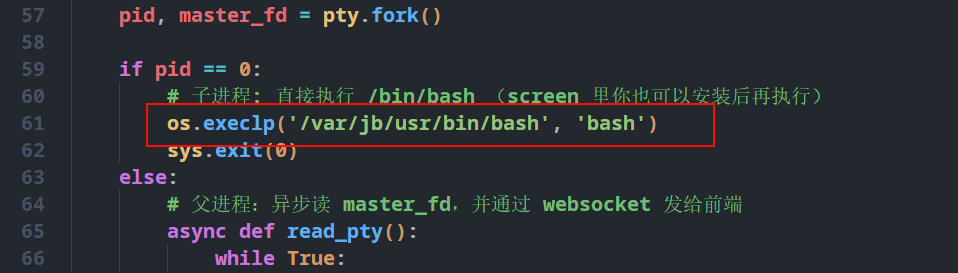

使用get-pip通过python3运行 来获取pip

通过pip安装 aiohttp 依赖 运行server.py

使用前请确认下你的实际终端位置 可以使用`which bash`获取

```
root@C20241108118141:~# which bash
/usr/bin/bash
root@C20241108118141:~# 
```

`/usr/bin/bash` 就是你的实际bash位置



替换`/var/jb/usr/bin/bash`为你终端实际位置